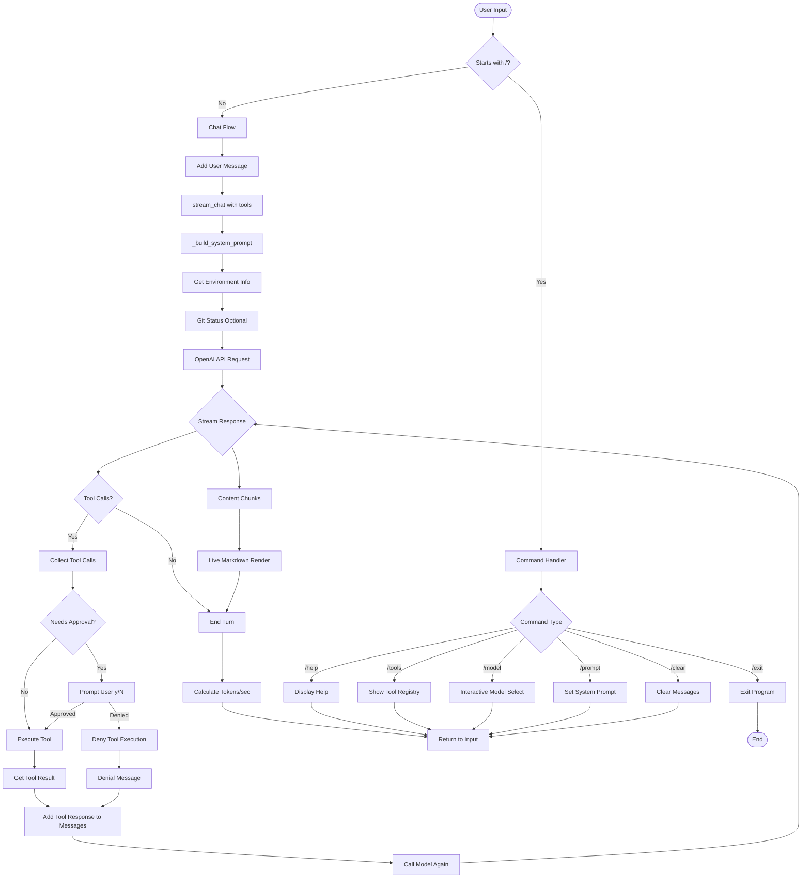
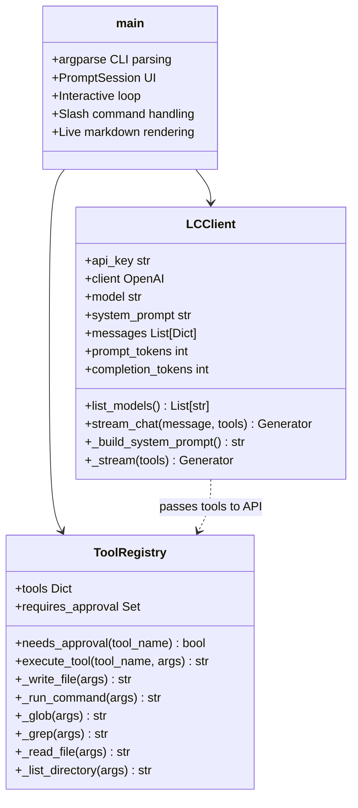
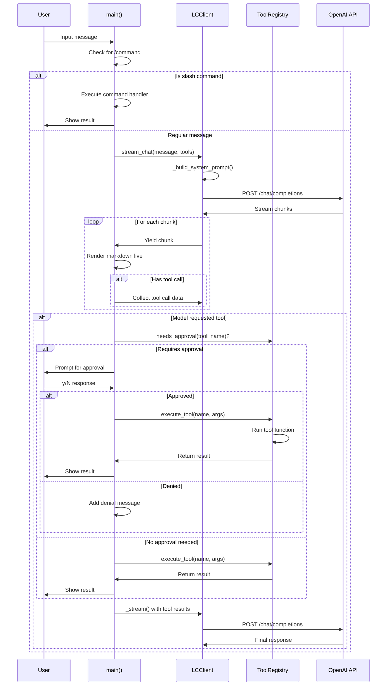
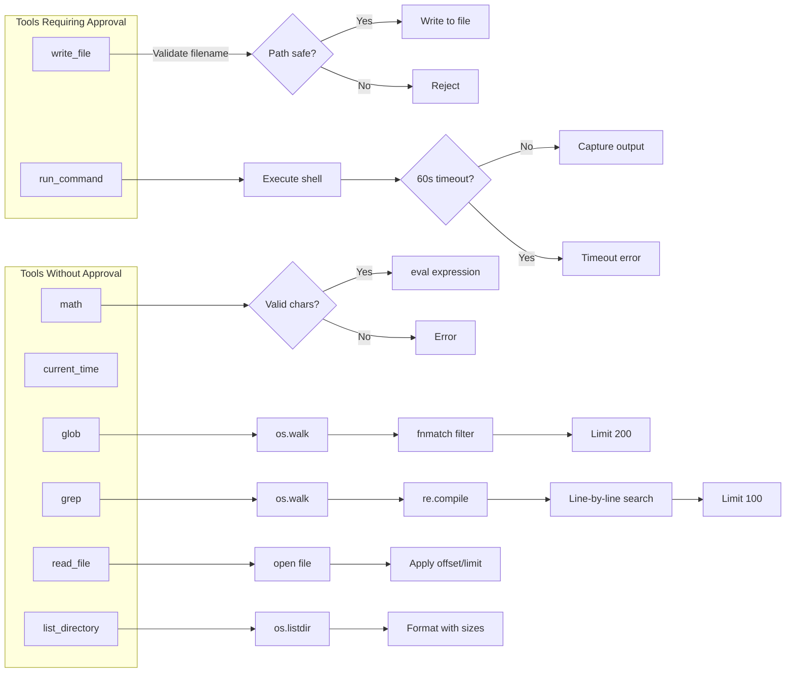

# LC Architecture Diagram

## Component Overview

```mermaid
graph TB
    subgraph "Main Entry Point"
        A[main()] --> B[Parse CLI Args]
        B --> C[Initialize LCClient]
        C --> D[Load System Prompt]
        D --> E[Initialize PromptSession]
        E --> F[Initialize ToolRegistry]
        F --> G[Start Interactive Loop]
    end
    
    subgraph "LCClient"
        H[LCClient]
        H --> H1[api_key]
        H --> H2[client OpenAI]
        H --> H3[messages history]
        H --> H4[model selection]
        H --> H5[token tracking]
    end
    
    subgraph "ToolRegistry"
        I[ToolRegistry]
        I --> I1[math]
        I --> I2[current_time]
        I --> I3[write_file]
        I --> I4[run_command]
        I --> I5[glob]
        I --> I6[grep]
        I --> I7[read_file]
        I --> I8[list_directory]
    end
    
    G --> H
    G --> I
```

## Interactive Chat Flow



## Class Structure



## Data Flow



## Tool Execution Flow



## Key Features

1. **Interactive CLI**: Uses `prompt_toolkit` for rich terminal UI with history, completion, and live rendering
2. **Streaming Responses**: Real-time markdown rendering with `rich.Live`
3. **Tool System**: 8 built-in tools with optional user approval for dangerous operations
4. **Environment Context**: Automatically includes date, CWD, platform, and git info in system prompt
5. **Token Tracking**: Displays prompt/completion tokens and tokens/sec
6. **Model Selection**: Interactive model picker when connecting to custom hosts
